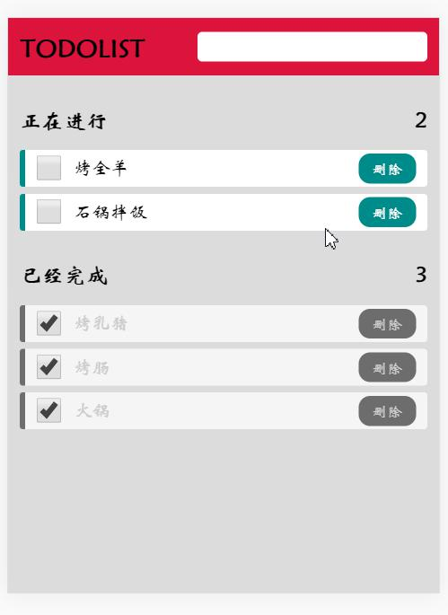

# 手机端简易todolist
## 使用方式
网页上查看按f12 查看手机页面
1. 引入todolist.css样式

  ```html
  <link rel="stylesheet" type="text/css" href="../css/todolist.css"/>
  ```

2. 引入rem.js 简易rem布局插件

  ```html
  <script src="../js/rem.js" type="text/javascript" charset="utf-8"></script>
  ```

3. 引入todolist.js 实现交互

  ```html
  <script src="../js/todolist.js" type="text/javascript" charset="utf-8"></script>
  ```


